***<h1 align = "center">Нейронная сеть Хопфилда</a>***

**<h2> Задача: </h2>** 

Задача состоит в восстановление зашумлённого дискретного набора. 

**<h2> Входные данные: </h2>** 

Данные, подаваемые на вход сети, имеет следующий вид:

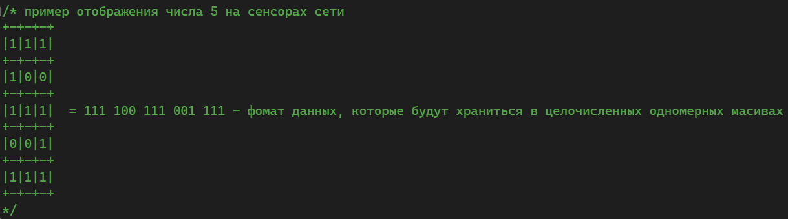  
  

При этом есть стандартные данные, на которых обучается сеть и есть повреждённые данные, относительно которых сеть будет выдавать ответ.

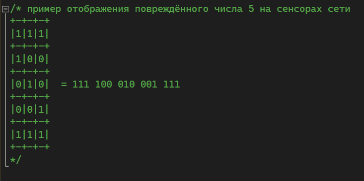

Также стоит учитывать то, что сеть Хопфилда работает с биполярными дискретными значениями, т.е. с {1, -1}.

**<h2> Память сети: </h2>** 

Сеть Хопфилда способна запоминать образы и восстанавливать их, если они были некоторым образом повреждены. Ниже будет рассказано, как сохранять образы, а сейчас поговорим о пределах сети. Дело в том, что сеть не может хранить много образов. Количество на запоминание ограничено формулой:

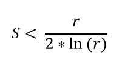

Где S - количество сохранённых образов, а r - размерность входной цепочки.

Если вышеуказанное условие нарушается, то сеть может выдавать ответы-химеры, которые являются смесью сохранённых образов. 

**<h2> Обучение: </h2>** 

Обучение проходит по правилам Хебба.

Правило Хебба для сети выглядит следующим образом: 

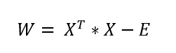

Из формулы выше, становится понятно, что размерность весов сети Хопфилда равна [input_range x input_range]. При этом главная диагональ равна нулю. Ниже приведены более подробные формулы для тренировки сети:

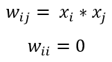

При этом, если данные не удалось привести к биполярному виду {1, -1}, то можно воспользоваться формулой для дискретного формата {1, 0}.

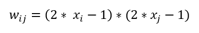

Как уже было ранее сказано, сеть Хопфилда запоминает поданные ей образы, вот формула для запоминания нескольких образов:

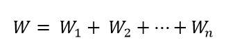  

Где n - количество образов.  

Также, можно и так:

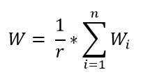  

**<h2> Ответ сети: </h2>** 

Сеть принимает последовательность, сеть возвращает последовательность. Значение каждого элемента последовательность можно определить как:

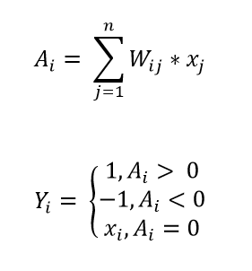  

**<h2> Результаты: </h2>** 

Качество сети восстанавливать образы характеризуется количеством повреждённых бит (расстоянием Хемминга). 

И так, сохраним 0 и 5 в сети. 

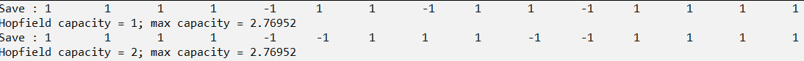  

Как мы видим, 2 образа это максимум запоминающей способности сети. И так, давайте подадим на вход зашумлённые последовательности 0 и 5:

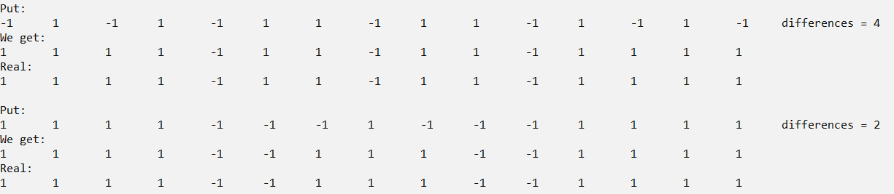  

А теперь подадим зашумлённую 7 и чистую 6 на вход сети:

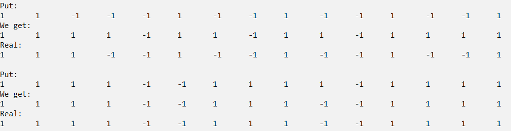  

Как мы видим, сеть определила 7 как 0, а 6 как 5.

А теперь давайте сохраним ещё и 7:

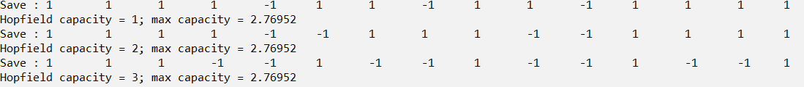  

Подадим те же значения, что и прежде:

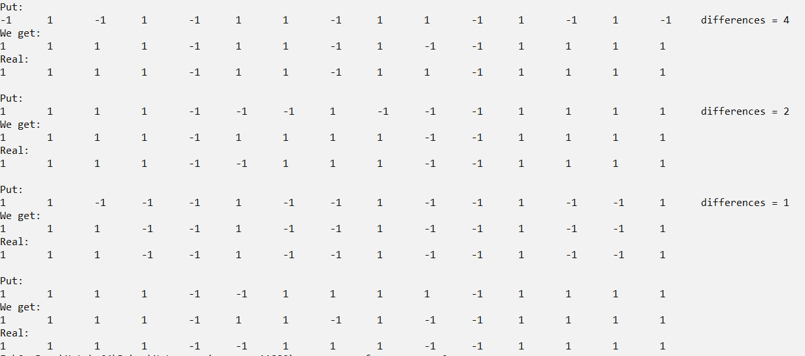  

Как мы видим, сеть распознала только число 7. Но не смогла восстановить зашумлённые 0 и 5. Вот они - химеры. Выход сети смешался с сохранёнными образами. 6 кстати тоже не удалось  идентифицировать одним из существующих сохранённых образов.

