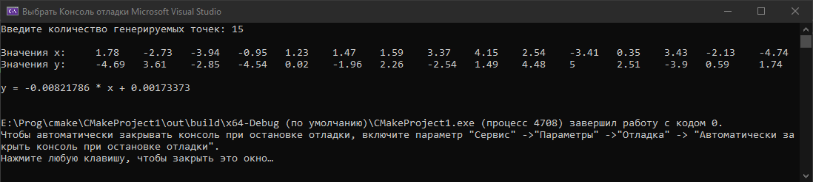
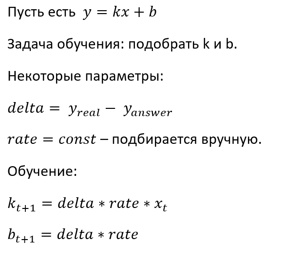
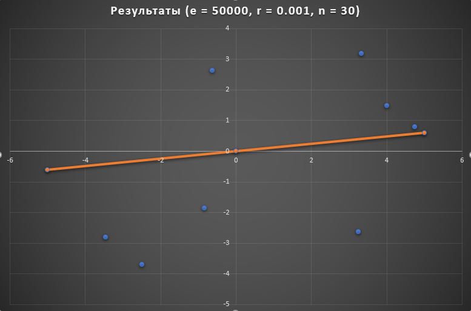

***<h1 align = "center">Однослойный персептрон распознования</a>***

**<h2> Задача: </h2>** 

Упростить себе нахождение прямой по методу наименьших квадратов с помощью нейронных сетей.

**<h2> Входные данные: </h2>** 

Данными являются просто точки в любом количестве и в любом диапазоне.  
Впрочем, я брал точки в диапазоне [-5; 5] с точностью до 2 знаков. 

  

**<h2> Обучение: </h2>** 

Обучение проходит delta-правилу.

  

**<h2> Результаты: </h2>** 

Сеть настроила свои параметры и теперь можно получать значение функции, передавая ей как отдельные значения, так и целы цепоычки значений.  

Также результаты представлены ниже:
Синие точки - обучающая выборка
Оранжевая линия - результат сети

  