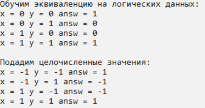

***<h1 align = "center">Решение логических операций</a>***

**<h2> Исследование логических операций на линейную разделимость </h2>** 

  

**<h2> Сеть для линейно разделимых операций </h2>** 

Для решения логической линейно разделимой задачи подойдёт самая простая модель перспетрона. Его схема приведена ниже. 

  

Произведём расчёт сети, использующая пороговую функцию активации:

  

Для обучения сети воспользуемся дельта-правилом:

  

**<h2> Сеть для линейно не разделимых операций </h2>** 

Решение для линейно разделимых операций достаточно простое и удалось запрограммировать решение 14 функций, однако такая сеть не способна решить задачи, которые линейно не разделимы. Тогда воспользуемся следующей схемой:

Рассчитаем сеть:

  

Обучим сеть с помощью обобщённого дельта-правила.  
Обучим выходной нейрон:

  

Найдём ошибки по выходам нейронов 1 и 2:

  

Обучим нейрон 1:

  

Обучим нейрон 2:

  

**<h2> Результаты </h2>** 

  

  

Результаты переобучения на разных данных:

  

Подадим другой тип данных:

  
