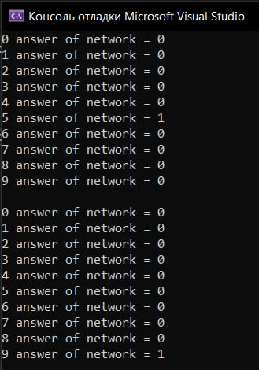

***<h1 align = "center">Однослойный персептрон распознования</a>***

**<h2> Задача: </h2>** 

Задача состоит в распозновании чисел.

**<h2> Входные данные: </h2>** 

Данные, подаваемые на вход сети, имеет следующий вид:

  

Среди данных есть повреждённые числа.

**<h2> Обучение: </h2>** 

Обучение проходит по правилам хебба.

**<h2> Результаты: </h2>** 

Изначально сеть училась распозновать число 5, но потом переобучил на распознование числа 9.

  

При этом, сеть способна распозновать числа,даже если они были искажены.
