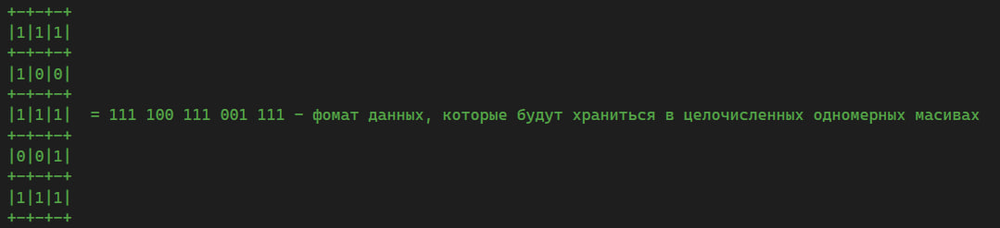
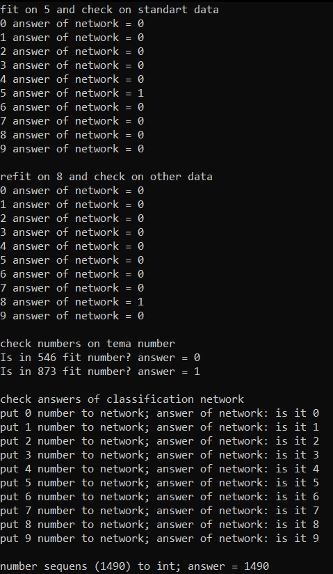

***<h1 align = "center">Однослойный персептрон распознования</a>***

**<h2> Задача: </h2>** 

Задача состоит в распозновании цифр и поиска определённой цифры в числе, а также в преобразовании последовательностей датасета в число.

**<h2> Входные данные: </h2>** 

Данные, подаваемые на вход сети, имеет следующий вид:

  

Среди данных есть повреждённые числа.  
При этом есть стандартные данные, на которых обучается сеть и есть повреждённые данные, относительно которых сеть будет выдавать ответ.

**<h2> Обучение: </h2>** 

Обучение проходит по правилам Хебба.

**<h2> Результаты: </h2>** 

Изначально сеть училась распозновать цифру 5, но потом переобучил на распознование цифры 8. Потом стал искать цифру 8 в различных числах.  
Далее занялся преобразованием последовательностей в числа.

  

При этом, сеть способна распозновать числа, даже если они были искажены.
